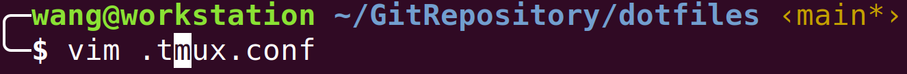

# Tmux - Customization

There are two sessions:

- emacs session with one window startup

- workspace session with one unnamed window.


The unnamed window in workspace session has a default three buffers:


## How to Install

[Tmux](https://github.com/tmux/tmux) 3.2+ is recommended, because configuration is dramatically simplified.

```shell
# basic dependencies
$ sudo apt update
$ sudo apt install build-essential bison pkg-config libevent-dev libncurses-dev xclip

# build from source
$ wget https://github.com/tmux/tmux/releases/download/3.3a/tmux-3.3a.tar.gz
$ tar -zxf tmux-*.tar.gz
$ cd tmux-*/
$ ./autogen.sh
$ ./configure --prefix="/usr/local"
$ make -j8
$ sudo make install
```


## tmux Configuration

After installation, you can run tmux by simply invoking `tmux` in terminal. tmux can be customized, you may read tmux manuals for how to tweak its behaviors. 

My configuration is stored in `.tmux.conf`. Let tmux read this file like:

```shell
$ tmux -f /path/to/.tmux.conf
```

Because tmux will look for user config file named `.tmux.conf` in the home directory, a symbolic link works:

```shell
$ link -s /path/to/.tmux.conf $HOME/.tmux.conf
```

If you prefer to using alias, then append this line to shell source file:

```shell
alias tmux="tmux -f /path/to/.tmux.conf"
```


## Shell Integration

Put the following lines to your favorite shell source file, such as `.bashrc` or `.zshrc`:

```bash
TMUX_BIN="/path/to/tmux-bin"       # This is optional and the default value is set by $(which tmux)
DOTFILES="/path/to/dotfiles-repo"  # This is mandatory
source ${DOTFILES}/.shellrc.tmux
```

Then, you can use the following command lines:

- `tnew [session-name]`: Equal to `tmux new` or `tmux new -t`. Create a tmux session with optional session name
- `tls`: Equal to `tmux list-session`
- `tich [session-id]`: Equal to `tmux attach` or `tmux attach -t`. It means *tmux-which*, the most recent or the optionally specified one.
- `trename <session-id>`: Equal to `tmux rename -session -t`
- `tkill <session-id>`: Equal to `tmux kill-session -t`
- `tdrop`: Equal to `tmux kill-server`
- `tlayout`: Create a predefined layout


## True Color

I seldom use any color themes but only the default one from GNOME terminal. To enable 256 true color in tmux, append these lines to the `.tmux.conf`:

```shell
# Set 256 colors
set -g default-terminal "xxxx-256color"
```

Note that the `xxxx` can be replaced with `xterm`/`screen`/`tmux`, try any of them if the others are invalid in your case.

If you use zsh-autosuggestion plugin, like me, after this customization, the dark and light indicator for suggestion should work normally.

| Before                                                       | After                                                        |
| ------------------------------------------------------------ | ------------------------------------------------------------ |
|  |  |

If you are a vim enthusiast, you may quickly find that the color in vim is still odd. Try this to bring color back:

```vimrc
" Keep color as normal in a terminal multiplexer(i.e. tmux) as outsides
set background=dark
set t_Co=256
```


## Keybindings

| Function | Key Sequence         |
| -------- | -------------------- |
| Prefix   | C-j (default is C-b) |

Related to Pane

| Function                                      | Key Sequence  |
| --------------------------------------------- | ------------- |
| Split horizontally                            | \<prefix> %   |
| Split vertically                              | \<prefix> "   |
| Close pane                                    | \<prefix> x   |
| Switch to the next pane                       | \<prefix> o   |
| Move all pane forward                         | \<prefix> C-o |
| Move all pane backward                        | \<prefix> M-o |
| Toggle current pane fullscreen on/off         | \<prefix> z   |
| Make current pane shown in a separated window | \<prefix> !   |

Related to Window

| Function            | Key Sequence |
| ------------------- | ------------ |
| Create a new window | \<prefix> c  |
| List all windows    | \<prefix> w  |
| Rename window       | \<prefix> ,  |


## Activate Tmux Conf

Inside tmux, any modification to conf won't take effect until you source it.

```shell
$ tmux source-file /path/to/.tmux.conf
```


## Reference

[Vim color scheme changes in tmux #699](https://github.com/tmux/tmux/issues/699)

[A simple introduction, in Chinese](https://www.ruanyifeng.com/blog/2019/10/tmux.html)

[oh my tmux](https://github.com/gpakosz/.tmux)

